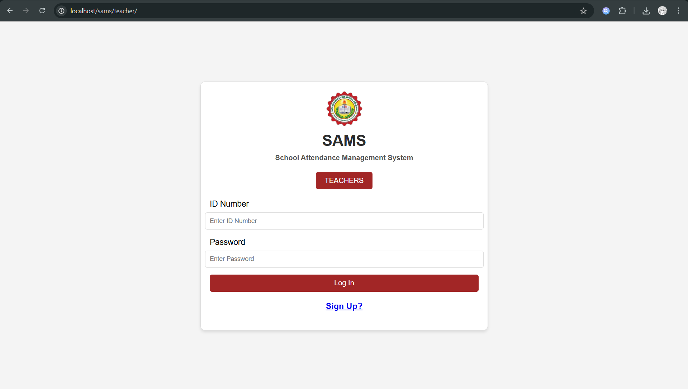
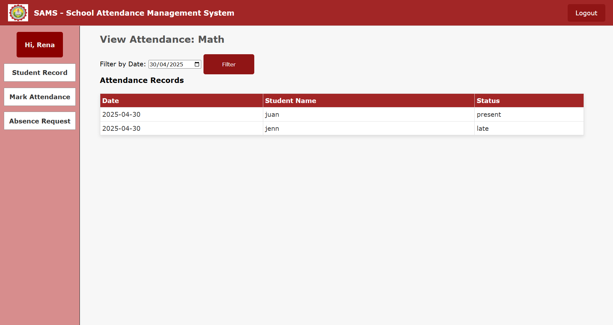
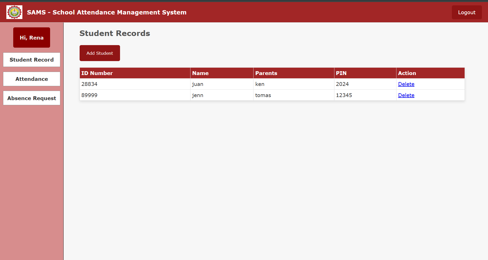
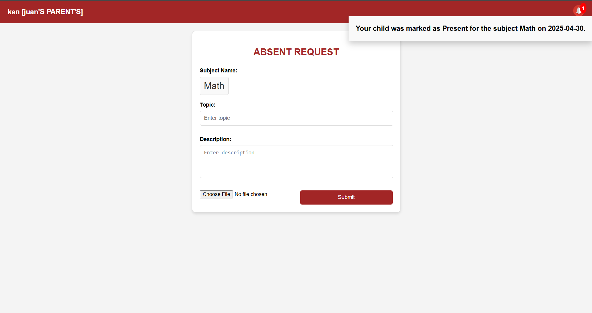

# 🎓 School Attendance Management System

A simple attendance tracking system built as a project during my 2nd year, 1st semester as an IT student. This system helps record, manage, and monitor student attendance efficiently.

---

## 🛠️ Features

- 📋 Add and manage student records  
- 🕒 Mark attendance (Present/Absent)  
- 📅 View daily and monthly attendance  
- 🗃️ Stores data securely in a database  
- 👤 Simple and user-friendly interface  

---

## 💻 Technologies Used

- PHP
- MySQL
- NetBeans / XAMPP
- HTML & CSS (for web version)

---

## 📷 Screenshots

## 📷 Screenshot

---

## 📂 How to Run
1. Clone the repo  
2. Move files to `htdocs` folder  
3. Import `.sql` file into phpMyAdmin  
4. Access via `localhost/projectname`

---

## 🧠 Author

**Gwen Balajediong**  
IT Student | Passionate about software and system development  
📅 2nd Year, 1st Sem  
📍 [SKSU - Isulan Campus]
